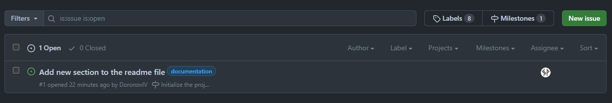
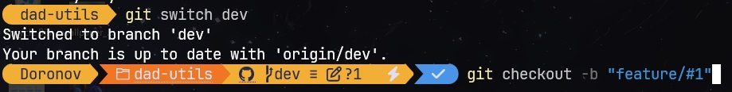
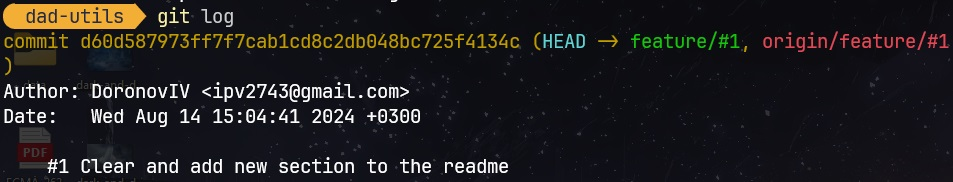
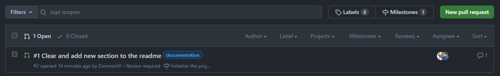

## How to contribute
  - pick yourself a free issue or create a new one based on the current milestone;
 
 
 
  
  - upon cloning this repository, create a new branch named: "feature/#N" where "N" is a number of the issue. Note that if the issue has "bug" label attached, you should name your branch "bugfix/#N" instead;
 
 
 

  - when you finish your work, commit it with a message like: "#N message", where "N" is the number of your issue. The message should be as short and informative as possible;
 
 
 

  - push your branch and create a pull request;
 
 
 

  - after x-review, make changes required until no unhandled messages are left  
  (if you have to make changes, just create another commit on your local branch and push);

  - upon having all necessary approves, complete your PR.
